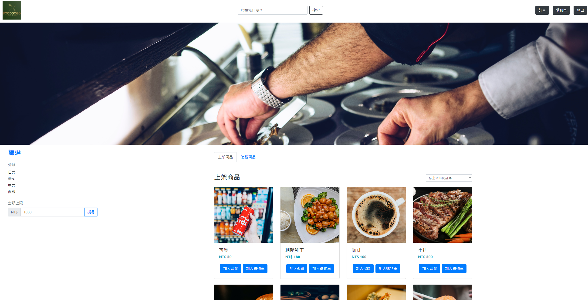

# 購物網站



## 介紹

這是一個使用 Vue3 + Node.js + MySQL 打造的購物網站，主要提供瀏覽、篩選和排序商品、買家管理購物車商品、商家管理商品功能。

測試用帳號:
管理者:
account: admin@gmail.com
password: 123456

使用者:
account: user1@gmail.com
password: 123456

## https://ian920511.github.io/foodgogo/#/

---

## 功能

- 使用者需註冊會員並登入才能購物網站
- 可以觀看全部商品
- 可以使用分類、關鍵字、金額範圍、價格排序等來查看及搜尋商品
- 賣家可以新增、刪除、修改商品資訊
- 買家可以新增、刪除、修改購物車內容
- 賣家可以在物品刪除評論
- 買家可以在物品新增評論
- 使用者可以在訂單資訊觀看購買或賣出資訊

---

## API Doc

API 設計文件資料:

## https://www.foodgogo2024.com/api-docs/

---

## Backend Technique

### Environment

- Node.js/Express.js

### Database

- MySQL

### Cloud Services

- AWS EC2
- AWS VPC
- AWS RDS
- AWS Route53

### Networking

- HTTP & HTTPS
- Domain Name System (DNS)
- PM2
- SSL

### Test

- Unit test: Jest, Supertest

### Third Party Library

- jsonwebtoken
- bcrypt
- multer
- prisma

### Version Control

- Git/GitHub

---

## 開始使用

1.先確認有安裝 node.js 與 npm

2.開啟終端機(Terminal)，clone 此專案

```bash
git clone https://github.com/Ian920511/foodgogo-backend.git
```

3.初始化

```bash
cd foodgogo-backend //進入存放檔案的資料夾
npm install  //安裝插件
```

4.新增 .env 檔，設定環境變數連線，並根據 .env.example 檔案內資訊設置環境變數

5.安裝完成後，需建立資料庫及新增種子資料，輸入下方程式碼:

```bash
npx prisma generate
npx prisma db push
npx prisma db seed
```

6.完成後，輸入

```bash
npm run start
```

7.看見此行訊息則代表順利運行

```bash
Sever is running on http://localhost:3000
```

8.可以使用以下帳號密碼進行登入測試

```bash
管理者:
account: admin@gmail.com
password: 123456

使用者:
account: user1@gmail.com
password: 123456
```

9.若需要暫停伺服器，則輸入

```bash
ctrl + c
```

---

## 規格

- 程式編輯器: [Visual Studio Code](https://visualstudio.microsoft.com/zh-hant/ "Visual Studio Code")
- 使用框架: [express](https://www.npmjs.com/package/express)@4.18.2
- 資料庫: [MySQL]
- 其他工具及版本請詳見 package.json
